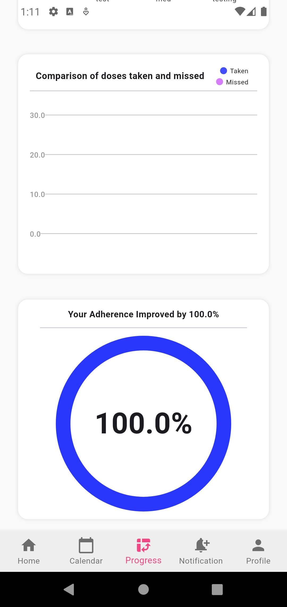

# Ahtem - Medication Tracker and Notification App

Ahtem is a medication tracker and notification app designed specifically for teenagers with chronic conditions. The app aims to address the widespread issue of medication non-adherence by providing a user-friendly platform that helps users manage their medication schedules effectively. With features like Medication Reminders, a Calendar, Progress Tracking, and Notifications, Ahtem ensures that teenagers can maintain their health regimen consistently and reliably. The app is tailored to the unique needs and lifestyles of teenagers, making medication management straightforward and engaging.

## Features

- Medication Reminders: Sends timely reminders based on user-inputted medication schedules.
- Calendar: Provides users with an organized view of their medication regimen.
- Progress Tracking: Displays user progress through charts and statistics.
- Notifications List: Sends notifications for medication doses and enhances lifestyle.
- User Profile Management: Allows users to set up and manage their profiles.

## Screenshots




## Getting Started

### Prerequisites
- Flutter SDK: [Installation Guide](https://flutter.dev/docs/get-started/install)
- Dart: [Installation Guide](https://dart.dev/get-dart)

### Installation
1. Clone the repository
   ```sh
   git clone https://github.com/budur1/Ahtem
   ```
2. Change to the project directory
   ```sh
   cd medication_reminder_vscode
   ```
3. Install dependencies
   ```sh
   flutter pub get
   ```

### Running the App
1. Connect your device or start an emulator.
2. Run the app
   ```sh
   flutter run
   ```

## Usage
1. Open the app and create a new account.
2. Input your medication schedule.
3. Set up reminders for each medication.
4. Use the calendar to view your medication regimen.
5. Track your progress with the provided charts and statistics.
6. Manage your notifications and profile settings as needed.

## Contributing
1. Fork the repository.
2. Create your feature branch (`git checkout -b feature/AmazingFeature`).
3. Commit your changes (`git commit -m 'Add some AmazingFeature'`).
4. Push to the branch (`git push origin feature/AmazingFeature`).
5. Open a Pull Request.

## License
Distributed under the MIT License. See `LICENSE` for more information.

## Contact
 [ahtem.application@gmail.com](mailto:ahtem.application@gmail.com)

Project Link: [https://github.com/budur1/Ahtem](https://github.com/budur1/Ahtem)
```